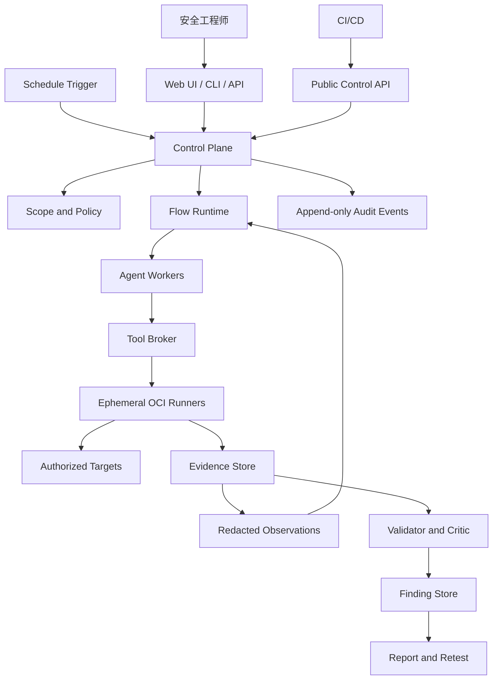

# VulnLoom 产品架构与长期开发路线（评审稿）

状态：`DRAFT_FOR_REVIEW`

版本：`0.2`

日期：`2026-09-08`

产品定位反方评审及修正理由见
[`PRODUCT-POSITIONING-REVIEW.md`](./PRODUCT-POSITIONING-REVIEW.md)。

## 1. 文档目的

本文定义 VulnLoom 的长期产品边界、架构分层、领域模型、工作流、安全边界、测试体系和分阶段路线。
它用于设计评审、ADR 决策、里程碑拆解和验收，不代表当前代码已经具备文中全部能力。

现有 `ROADMAP.md` 继续记录已经完成的底座和白盒纵切历史；本文是后续产品方向与模块边界的主要依据。
若两者对未来产品范围的描述冲突，以本文经评审后的版本为准。安全不变量始终以仓库根目录
`AGENTS.md` 为最高约束。

## 2. 产品愿景

VulnLoom 是面向明确授权目标的自动漏洞发现、验证、复测与报告平台。用户可以从源码、URL、域名、IP、
网段或它们的组合开始，以自然语言描述目标，由系统在结构化 Scope 和执行策略内完成长任务。

### 2.1 一句话定位

> VulnLoom 是面向组织自有或受托软件与网络目标的证据优先自主漏洞研究和攻击验证平台：从源码或运行目标
> 出发，在代码强制的授权边界内发现并动态验证漏洞，形成可复测的 Finding、攻击路径和报告。

这句话同时限定了客户、目标、方法和输出：

- 主要用户是企业安全、AppSec、研发安全和授权渗透测试团队；
- 主要目标是软件源码、正在开发或已经上线的 Web/API 服务，以及明确授权的外部攻击面；
- 核心能力是 Agent 驱动的发现、工具执行和动态验证；
- 核心差异是 Scope、Evidence、Critic 和可复测状态由代码保证；
- 最终价值是减少真实安全验证的时间和重复劳动，而不是展示模型会调用多少安全工具。

### 2.2 产品楔子与长期能力

四个入口长期保留，但产品以两条核心能力线和两类交付工作流组织：

1. **核心能力线 A：源码漏洞研究（Source Hunt）。** 保留并扩展现有白盒投入，逐步形成跨文件调查、
   程序分析、Fuzz、PoV、独立验证和修复复测能力，同时服务真实代码库与授权比赛环境；
2. **核心能力线 B：授权红队攻击模拟（Authorized Red Team）。** 从 URL、域名、IP 或 CIDR 出发，完成
   Recon、身份与业务流程测试、漏洞验证和受控攻击链；任何高影响动作仍受 Scope、Policy、Approval 和
   隔离边界约束；
3. **工程化工作流 C：上线前安全验收。** 将 Source Hunt、Web 动态测试或 Hybrid 组合成发布门禁、整改和复测；
4. **工程化工作流 D：生产环境定期巡检。** 将黑盒能力限制在 `production_safe` 策略内，增加调度、差异、
   历史 Finding 复测和覆盖账本。

Source Hunt 与 Authorized Red Team 决定产品的发现深度和攻击链深度；上线前验收与生产巡检负责把这些能力
稳定交付到软件生命周期。四个入口共享平台，但不共享完整 Prompt、工具集或执行强度。

### 2.3 产品承诺

VulnLoom 对每次任务承诺提供三类结果：

- `Coverage Ledger`：实际观察和测试了哪些资产、路径、身份、漏洞类别，哪些因策略、预算或能力未覆盖；
- `Evidence-backed Findings`：经过动态复现和独立反证的漏洞；
- `Unresolved Candidates`：有依据但尚未满足 Finding 标准的线索、缺失条件和建议人工步骤。

“没有 Finding”不能被表述为“目标没有漏洞”。任务报告必须同时展示覆盖范围、排除项、阻塞项和剩余不确定性。

北极星工作流是：

```text
自然语言目标 + 结构化授权范围
  → 资产或源码建模
  → Agent 规划与工具执行
  → Observation 驱动的重规划
  → 可复现的动态证据
  → 独立反证与裁决
  → Finding
  → 报告、修复建议与复测
```

VulnLoom 同时服务四个入口：

1. 源码漏洞研究；
2. 上线前安全验收；
3. 生产环境定期巡检；
4. 授权红队攻击模拟。

平台不把扫描器命中、模型判断或工具退出码直接当作漏洞。`Candidate` 必须经过可重复验证和独立反证，
才能成为 `Finding`。

## 3. 产品边界

### 3.1 四个入口

| 入口 | 典型输入 | 主要目标 | 默认 Visibility | 默认 Execution Profile |
| --- | --- | --- | --- | --- |
| 源码漏洞研究 | Repository、Source Archive、构建说明 | 找到源码级漏洞、PoV，可选修复 | `white_box` | `benchmark` |
| 上线前安全验收 | Staging URL，可选源码、API 文档和测试账号 | 在发布前完成动态渗透和整改报告 | `grey_box` 或 `hybrid` | `pre_release` |
| 生产环境定期巡检 | Domain、URL、IP、已登记资产 | 低影响发现新增暴露、回归漏洞和配置漂移 | `black_box` | `production_safe` |
| 授权红队攻击模拟 | Domain、IP、CIDR、演练目标和停止条件 | 从外部攻击者视角验证攻击链与防御效果 | `black_box` 或 `grey_box` | `red_team` |

四个入口是任务模板，不是四套独立平台。它们共用 Control Plane、Policy、Runner、Evidence、Finding、
Report 和审计协议。

### 3.2 两个正交维度

不能用一个 `mode` 同时表达信息可见性和执行强度。

`Visibility` 表达 Agent 可获得的信息：

- `black_box`：只有网络目标和公开可观察信息；
- `grey_box`：增加测试账号、API 文档、架构提示或有限内部信息；
- `white_box`：增加源码、构建材料和测试数据；
- `hybrid`：源码分析和 Live Target 动态测试共同参与同一 Flow。

`ExecutionProfile` 表达允许的行为：

- `benchmark`：本地靶场、CTF、公开或私有 Benchmark；
- `production_safe`：生产环境低影响巡检；
- `pre_release`：测试或预发布环境的主动验证；
- `red_team`：经明确批准的攻击链和后渗透模拟。

二者必须在 Flow 创建前由可信控制面固定。Agent 无权在运行时扩大 Visibility、Scope 或
Execution Profile。任何权限提升都必须形成新的、内容绑定的授权决定。

### 3.3 组合兼容矩阵

不是所有 Visibility 与 ExecutionProfile 组合都自动合法：

| Visibility | benchmark | production_safe | pre_release | red_team |
| --- | --- | --- | --- | --- |
| `black_box` | 允许 | 允许 | 允许 | 允许 |
| `grey_box` | 允许 | 允许，但身份必须是生产专用测试身份 | 允许 | 允许 |
| `white_box` | 允许 | 只允许离线源码分析 | 允许 | 仅作为攻击情报输入 |
| `hybrid` | 允许 | Live部分受生产策略限制 | 允许 | 允许 |

矩阵只决定配置是否有意义，不能替代具体 Scope、Target、ImpactClass 和 Approval 判定。

### 3.4 自治等级

“Autonomous”必须用可测试等级表达，不能作为二元营销词：

- `A0_manual`：系统只存储人工操作和 Evidence；
- `A1_assisted`：模型解释、建议和生成计划，人工执行；
- `A2_bounded_execution`：Agent 可以在预批准工具集内执行单步或短链任务；
- `A3_adaptive_flow`：Agent 能根据 Observation 多轮重规划，并在风险边界处等待输入或 Approval；
- `A4_goal_driven_campaign`：Agent 能围绕目标构建多阶段攻击路径、恢复长任务并管理多个身份和资产。

四入口的最低产品目标：源码研究、上线前验收和生产巡检达到 `A3`；授权红队达到 `A4`。当前固定
Recommendation 和双工具 Session 只属于 `A1` 到受限 `A2`，不得宣传为完整自主渗透。

### 3.5 近期非目标

- 不在首个黑盒版本中实现互联网范围的任意资产搜索；
- 不在首个版本中实现无人监督的破坏性后渗透；
- 不把知识图谱、向量数据库或微服务作为基本依赖；
- 不一次性接入上百种安全工具；
- 不自动向披露平台提交报告或申请 CVE；
- 不声称自动测试可以替代人工红队或合规渗透测试。

VulnLoom 近期也不是通用 EASM、漏洞扫描器聚合平台、企业内网 BAS、云安全姿态平台或 SOC 自动化平台。
与这些系统集成时，只通过 adapter 导入资产、发现或通知，不扩大核心产品边界。

## 4. 总体架构决策

### 4.1 一个产品、一个模块化仓库、多个引擎

VulnLoom 采用模块化单仓库。共享安全与领域能力只有一个权威实现，发现方法由独立 Engine 提供。

```text
VulnLoom
├── Control Plane
├── Orchestration Runtime
├── Tool Broker and Runners
├── Evidence / Findings / Reports
├── Source Hunt Engine
├── Web Pentest Engine
└── Hybrid Engine
```

Engine 可以组合，但不能直接依赖另一个 Engine 的内部实现。跨 Engine 只交换版本化领域对象，如
`AttackSurface`、`StaticSignal`、`Candidate`、`ValidationPlan` 和 `EvidenceRef`。

### 4.2 逻辑单体优先，部署边界后移

早期使用单进程 Control Plane、SQLite、独立 Worker 进程和临时 OCI 容器。模块边界通过 Python 包、类型化
协议和 adapter 强制，不通过提前拆微服务实现。

当出现独立扩缩容、远程隔离网段、团队权限或语言运行时需求时，可以把 Runner、Scheduler、Web API 或
Fuzzing 集群拆成独立服务。拆分后仍使用同一版本化协议，领域层不依赖消息队列、Docker、模型 SDK 或数据库
实现。

### 4.3 参考架构取舍

- 参考 Strix 的 URL/源码统一入口、动态工具协作、PoC 和报告体验；
- 参考 PentAGI 的 Flow/Task/Subtask/Action、Generator/Refiner、长任务恢复和工具循环；
- 参考 Nebula 的 Scope、审批、预算、OCI 隔离、Evidence 与操作员工作台；
- 参考 PentestGPT 的阶段式 MVP、任务树和可复现实验；
- 参考 Vulnhuntr/DeepSec 的跨文件上下文获取和大型仓库调查；
- 参考 Defending Code Harness、FuzzingBrain 和 AIxCC 的 Fuzz/ASAN/PoV 动态证明；
- 参考 HexStrike 的工具分类，不继承其宽泛 MCP 执行边界；
- 不直接依赖已归档框架；许可证不兼容的项目只研究设计，不复制实现。

## 5. 系统上下文



信任关系：

- Control Plane、Policy Engine、领域 reducer 和 Evidence 完整性校验属于可信计算基；
- LLM、目标源码、目标网页、HTTP 响应、工具输出、附件、外部搜索结果全部是不可信输入；
- Worker 和 Runner 不持有改变 Scope、授予 Approval、提升 Candidate 或提交报告的能力；
- 提示词用于任务指导，不承担权限控制。

## 6. 建议的代码边界

长期目标包结构：

```text
src/vulnloom/
├── domain/                 # 纯领域对象、状态机、命令和事件
├── control_plane/          # 事务服务、授权、预算、审计
├── orchestration/          # Flow、任务图、调度、恢复、Agent循环
├── targets/                # TargetSpec、资产、身份和快照
├── policy/                 # Scope编译与逐动作判定
├── agent_runtime/          # 模型消息、Provider adapter、上下文压缩
├── broker/                 # 类型化工具注册和调用门禁
├── runners/                # OCI、浏览器、Fuzz、离线Runner adapter
├── evidence/               # 不可变正文、脱敏、引用和完整性
├── findings/               # Candidate、Critic、Finding、去重和复测
├── reporting/              # 报告、差异、导出和人工审阅
├── engines/
│   ├── source_hunt/        # 白盒发现、构建、Fuzz、PoV
│   ├── web_pentest/        # 资产、Web/API/Auth、动态验证
│   └── hybrid/             # Source与Live Target关联
├── scheduler/              # 周期任务、触发器和并发租约
├── api/                    # HTTP/WS adapter
└── ui/                     # 单独前端项目或静态资源边界
```

依赖方向：

```text
Adapters / Engines / UI
          ↓
Application Services
          ↓
Domain
```

`domain` 不导入 Docker、HTTP 客户端、模型 SDK、数据库实现或披露平台 SDK。Engine 不直接访问容器和网络，
只能产生类型化任务或工具请求。

## 7. 核心领域模型

### 7.1 Engagement 与授权

`Engagement` 表示一次有法律和运营边界的安全任务集合，至少绑定：

- `authority_reference`；
- 授权主体和操作员；
- 有效时间；
- 目标和排除目标；
- 允许的测试类别；
- 请求、Token、计算和存储预算；
- 数据保留策略；
- 紧急停止与联系人；
- 审批要求。

授权材料正文不进入模型上下文。普通事件只保存引用和摘要。

### 7.2 TargetSpec

目标使用判别联合类型：

- `RepositoryTarget`；
- `SourceArchiveTarget`；
- `WebUrlTarget`；
- `DomainTarget`；
- `IpTarget`；
- `CidrTarget`；
- `ApiContractTarget`；
- `ContainerImageTarget`；
- `CompositeTarget`。

网络目标还需表达：

- 允许协议和端口；
- 允许的域名和通配子域；
- 明确排除的域名、IP、路径和服务；
- 是否允许资产扩展；
- DNS 解析策略和地址有效期；
- 允许的 HTTP 方法；
- 速率、并发和总请求预算；
- 生产或非生产标记；
- 测试身份引用。

发现的新资产先成为 `DiscoveredAsset`。只有被确定性 Scope 规则接受后，才能转为 `AuthorizedAsset` 并接收
主动工具调用。

### 7.3 Flow 层级

```text
Flow
├── Mission
├── Tasks
│   └── Subtasks
│       └── Actions
├── Budgets
├── Approvals
├── Checkpoints
└── Outcome
```

- `Mission`：用户目标的原文、结构化目标和验收条件；
- `Task`：可恢复的主要阶段，如 Recon、Auth Mapping、Validation；
- `Subtask`：一个专业 Agent 可以在有限预算内完成的目标；
- `Action`：一次模型调用、工具调用、领域命令或等待动作；
- `Observation`：工具结果的脱敏、受限投影；
- `Artifact`：不可变文件或结构化产物；
- `Checkpoint`：可安全恢复的权威执行位置。

### 7.4 Attack Surface

黑盒和混合引擎统一输出 `AttackSurfaceSnapshot`：

- 资产、地址、端口和服务；
- Web Origin、证书和重定向关系；
- 页面、路由、API、参数和内容类型；
- 技术栈与版本线索；
- 身份入口、注册、登录、找回、MFA、OAuth；
- Cookie、Session、JWT 和角色边界；
- 上传、下载、回调和外部集成点；
- 每项事实的 EvidenceRef、首次和最后观察时间；
- 来源、置信度和是否已授权主动测试。

快照不可变。周期任务通过 Snapshot Diff 表达新增、消失和变化，不能覆盖历史事实。

### 7.5 Candidate 与 Finding

Candidate 来源可以是：

- 静态分析；
- Agent 推理；
- Scanner 命中；
- Fuzz Crash；
- HTTP 行为差异；
- 认证或业务流程异常；
- 历史 Finding 复测。

无论来源如何，都进入相同裁决链：

```text
PROPOSED
  → VALIDATION_PENDING
  → VALIDATION_RUNNING
  → VALIDATED | NOT_REPRODUCED | INCONCLUSIVE | POLICY_STOPPED
  → CRITIC_REVIEWED
  → PROMOTED
```

只有 `PROMOTED` Candidate 可以形成 Finding。Finding 必须绑定目标版本或观察窗口、Scope 版本、复现条件、
影响、Evidence 集合和 Critic 结论。

## 8. Flow 状态机

建议的 Flow 状态：

```text
DRAFT
  → AWAITING_SCOPE_APPROVAL
  → READY
  → RUNNING
      ↔ WAITING_FOR_INPUT
      ↔ WAITING_FOR_APPROVAL
  → COMPLETED | PARTIAL | FAILED | TIMED_OUT | CANCELLED | POLICY_STOPPED
```

约束：

- `DRAFT` 只能创建 Scope 草案，不能调用目标工具；
- `READY` 必须绑定仍有效的 APPROVED Scope；
- 每次 Action 前重新验证 Scope、预算、租约和取消标记；
- `WAITING_FOR_APPROVAL` 不自动轮询或自动批准；
- 恢复时重开所有权威对象并验证摘要；
- 遗留执行不能自动重放可能产生副作用的 Action；
- 所有终态必须写清资源清理状态；清理未知时不能报告正常完成。

## 9. Agent 编排模型

### 9.1 首期 Agent 角色

- `Planner`：把 Mission 和当前事实变成有界 Task/Subtask 计划；
- `ReconAgent`：资产、服务、Web 和 API 表面建模；
- `SourceAgent`：源码入口、调用链和危险点调查；
- `WebAgent`：浏览器、HTTP、认证和业务流程调查；
- `Validator`：围绕一个 Candidate 设计最小验证实验；
- `Critic`：独立寻找不可达、已有控制、环境差异和替代解释；
- `Reporter`：仅使用 Finding 和可披露 Evidence 生成报告。

角色是工具权限和上下文策略，不要求每个角色对应常驻进程或不同模型。

### 9.2 Plan / Execute / Observe / Refine

```text
Planner produces typed Subtask
  → Control Plane admits Subtask
  → Agent proposes typed Action
  → Policy and Broker admit Action
  → Runner executes
  → Evidence stored
  → Observation projected
  → Planner refines remaining plan
  → done | ask | approval | continue
```

每轮必须受以下限制：

- 总模型 Token；
- 模型轮数；
- 工具调用数；
- 总请求和每秒请求数；
- 总墙钟时间；
- Evidence 和工作区大小；
- 相同工具/参数重复次数；
- 无进展轮数；
- Agent 委派深度和并发数。

### 9.3 上下文管理

模型上下文由可信 Context Builder 构造，按需包含：

- Mission 的结构化投影；
- 当前 Subtask；
- Scope 的不可执行摘要；
- 已确认的 Attack Surface 事实；
- Candidate 摘要；
- 最近 Observation；
- 有界历史摘要；
- 允许工具的 schema。

原始 Cookie、凭据、完整认证响应、未经脱敏的大型工具输出和授权材料不得进入模型上下文。摘要不是 Evidence，
必须携带可追溯的来源引用。

### 9.4 多模型接入与角色路由

模型是可替换的外部能力，不是领域层依赖。平台提供 Provider Center 管理 Provider、模型目录、能力探测、
角色路由、成本预算和健康状态。CUC/DeepSeek 是前期默认开发与真实验收 Provider，并作为首个已验证
Provider Profile 旁路迁入统一协议。新 adapter 完成旧新路径差分测试和经授权的真实调用验收前，现有调用路径
保持可用；迁移完成后，Agent 编排代码不再依赖 Provider 特定分支。

路由优先级为 `Flow 固定快照 > 任务显式选择 > Engine/角色路由 > 工作区默认值`。模型切换默认只影响新 Flow；
运行中的 Flow 保留 Provider、模型、协议 adapter 和能力清单的精确快照，避免同一次调查因隐式切换而失去
可复现性。降级与故障转移必须有界、可审计，不能跨越数据处理策略，也不能在已产生有副作用的 Action 后自动
换模型重试。

Provider 的显示名称、协议类型和能力元数据可以进入普通配置；API Key、私有网关地址和租户凭据只保存为受限
配置与不透明引用，不写入仓库文件、普通日志、Evidence、FTS 或模型上下文。Worker 仍不获得 Provider 凭据。
完整设计见 [`MODEL-PROVIDER-CONTROL-PLANE.md`](./MODEL-PROVIDER-CONTROL-PLANE.md)。

## 10. Tool Broker 与工具生态

### 10.1 ToolDescriptor

每个工具必须注册不可变 `ToolDescriptor`：

- 工具 ID、版本和实现摘要；
- 输入和输出 schema；
- 允许的 Agent 角色与 Runner Profile；
- 目标类型；
- 是否需要网络、凭据、写工作区或外部回连；
- `ImpactClass`；
- 支持的限速、超时、输出和并发上限；
- 参数规范化规则；
- Scope 提取器；
- Evidence 适配器；
- 清理协议；
- 所需 ApprovalAction。

### 10.2 ImpactClass

- `passive`：读取本地授权材料或公开离线数据；
- `read_only_network`：低影响网络观察；
- `state_changing`：可能创建、修改或删除目标状态；
- `external_callback`：OAST、Webhook、DNS/HTTP 回连；
- `credentialed`：使用真实测试身份；
- `post_exploitation`：主机命令、权限提升、横向移动或持久化模拟；
- `submission`：向外部平台发送报告。

一个工具可以同时具有多个影响标签。标签由可信注册和参数分析产生，不能由模型声明。

### 10.3 首批工具

黑盒只读纵切：

- `dns.resolve`；
- `tls.inspect`；
- `http.probe`；
- `web.fingerprint`；
- `web.crawl`；
- `browser.inspect`；
- `api.contract.inspect`。

主动验证纵切：

- `http.replay`；
- `browser.interact`；
- `parameter.enumerate`；
- `template.scan`；
- `poc.python.run`；
- 经过独立 adapter 包装的少量扫描器。

源码纵切：

- `source.search`；
- `source.read`；
- `source.references`；
- `source.callers`；
- `build.run`；
- `fuzz.run`；
- `crash.replay`。

不向 Agent 暴露一个绕过 Broker 的通用宿主 Shell。需要终端能力时，它只能存在于特定 Runner Profile，
由 Scope-aware egress、资源上限、命令审计和工作区隔离共同约束。

## 11. Runner 与隔离

### 11.1 Runner 类型

- `OfflineRunner`：单元测试和纯领域回放；
- `ReconRunner`：低影响、Scope 约束的网络工具；
- `BrowserRunner`：隔离浏览器、代理和测试身份；
- `ValidationRunner`：主动 PoC 和有界脚本；
- `SourceRunner`：只读源码调查；
- `BuildRunner`：执行不可信构建；
- `FuzzRunner`：Sanitizer、Coverage、Fuzzer 和 Crash；
- `ReportRunner`：无目标网络的报告生成。

### 11.2 强制属性

- 精确镜像摘要；
- 非 root；
- 删除多余 capabilities；
- 禁止 privileged、host PID、host IPC 和 host network；
- 不挂载宿主 Docker socket；
- 只挂载任务所需目录；
- 根文件系统尽可能只读；
- 独立临时工作区；
- CPU、内存、PID、磁盘、时间和输出上限；
- 最小环境变量白名单；
- 超时和取消后终止进程组并验证清理；
- 网络策略在容器外和 Broker 内双重执行；
- 失败时不回退到宿主执行。

隔离声明必须由真实容器和网络测试证明。

## 12. Scope、Policy 与 Approval

### 12.1 Scope 编译

人类批准结构化 Scope 后，Policy Compiler 生成版本化、内容寻址的执行策略。每次工具调用至少校验：

- Engagement 与 Target 绑定；
- 当前时间和 Scope 状态；
- 域名、IP、CIDR、端口、协议和路径；
- DNS 解析和连接 Peer；
- 身份引用；
- 测试类别和 ImpactClass；
- 请求、并发、计算和存储预算；
- Execution Profile；
- Approval；
- 目标是否生产环境。

无法归一化目标、DNS 结果漂移、重定向越界或策略语义不清时 fail-closed。

### 12.2 Approval 粒度

Scope 内的被动和低影响只读行为可以由初始授权覆盖。以下行为必须获得绑定具体动作的 Approval：

- 状态变更请求；
- 使用真实凭据；
- 外部回连；
- 不可信构建；
- 后渗透动作；
- 报告导出到外部系统或 Submission。

Approval 绑定规范化参数摘要、目标、Scope 版本、预期副作用、截止时间和最大使用次数。审批不能通过聊天文本、
Prompt 或模型输出产生。

### 12.3 紧急停止

操作员可以撤销 Scope 或停止 Flow。停止信号必须：

- 阻止新 Action；
- 取消运行中的模型和工具；
- 清理 Runner；
- 保留已有 Evidence；
- 记录未完成动作是否可能产生副作用；
- 不把不确定状态自动标记为成功或失败。

## 13. Evidence、隐私与凭据

### 13.1 Evidence 分层

- `Raw Evidence`：加密、访问受控的原始请求、响应、文件、截图和 Crash；
- `Redacted Evidence`：用于审阅、模型上下文和普通报告；
- `Observation`：面向 Agent 的最小投影；
- `Disclosure Artifact`：人工确认后可导出的证据子集。

每层都绑定前一层摘要，但访问权限不同。普通日志和搜索索引只接收脱敏元数据。

### 13.2 凭据模型

凭据只以 opaque reference 出现在任务协议中。Control Plane 通过短期 lease 将所需字节交给受限 adapter；
Worker、LLM、普通日志、数据库 JSON 和错误消息不得看到原始值。

测试身份应支持：

- 匿名；
- 自注册测试用户；
- 预置测试用户；
- 多角色测试用户；
- 控制方拥有的邮箱或手机号；
- 一次性恢复和 MFA 测试材料。

不得对真实第三方用户执行密码重置、撞库或账号接管。

## 14. 四个入口的详细工作流

### 14.1 源码漏洞研究

```text
Ingest source
  → Build repository model
  → Static signals and suspicious points
  → Agent requests bounded cross-file context
  → Candidate
  → Build/Fuzz/ASAN or targeted harness
  → PoV replay
  → Independent Critic
  → Finding
  → Report and optional Patch
```

首期继续支持 Python Web，随后通过 Language Adapter 增加 JavaScript/TypeScript、Go、Java 和 C/C++。

### 14.2 上线前安全验收

```text
Staging URL + optional source/spec/accounts
  → Fingerprint and crawl
  → API/Auth/role mapping
  → Source-informed hypotheses when available
  → Active validation
  → Minimal impact proof
  → Critic
  → Release report
  → Fix verification
```

允许更完整的状态变更测试，但必须使用测试数据和 Approval。报告要能作为发布门禁输入。

### 14.3 生产环境定期巡检

```text
Approved inventory + schedule
  → Safe discovery
  → Surface snapshot
  → Diff against baseline
  → Low-impact tests
  → Retest eligible historical findings
  → Findings delta
  → Human-reviewable report/notification
```

默认禁止破坏性 Payload、批量口令尝试、数据修改、外部回连和后渗透。`production_safe` 的默认策略只能收窄，
不能由任务 Prompt 放宽。

### 14.4 授权红队攻击模拟

```text
Objective + rules of engagement
  → External recon
  → Attack surface and hypotheses
  → Initial access attempts
  → Approved exploitation
  → Privilege and trust-path analysis
  → Approved post-exploitation steps
  → Goal evidence or stop condition
  → Attack path report
```

红队任务除 Scope 外还必须表达 Rules of Engagement：目标、允许技术、禁止行为、测试窗口、通知方式、数据处理、
停止条件和紧急联系人。首个红队版本聚焦 Web 外部攻击链；横向移动和持久化模拟在独立里程碑实现。

## 15. Web/API/Auth 能力路线

优先覆盖能够用低风险方法形成明确证据的类别：

- 暴露管理面、调试接口、备份和敏感信息；
- 用户名、邮箱或手机号枚举；
- 注册、邀请、登录和密码找回流程；
- MFA、恢复码、可信设备和备用认证流程；
- Session、Cookie、JWT、OAuth/OIDC；
- IDOR/BOLA 和功能级越权；
- CORS、CSRF 和开放重定向；
- SQL/NoSQL/命令/模板注入；
- XSS、HTML 注入和前端信任问题；
- SSRF、XXE 和不安全反序列化；
- 路径遍历、文件下载、上传和解析；
- GraphQL、REST 和 WebSocket；
- 速率限制、竞态和业务流程绕过；
- 暴露服务、默认配置和已知组件漏洞。

“未启用 MFA”只有在业务、权限、合规或风险模型要求时才能定性。Agent 必须区分缺少最佳实践、可被绕过的安全
控制和可复现漏洞。

## 16. Source Hunt 能力路线

Source Hunt Engine 逐步从固定 AST 规则升级为组合发现：

```text
Static analyzer results
  + Call/data-flow graph
  + LLM suspicious-point reasoning
  + Build/runtime metadata
  + Coverage-guided fuzzing
  + Sanitizer/crash evidence
  = Validated source Finding
```

LLM 用于缩小搜索空间、请求上下文、构造 Harness 和解释结果。确定漏洞是否存在由编译、执行、Crash、PoV、
HTTP 行为和独立重放等外部证据决定。

每种语言通过 `LanguageAdapter` 提供：

- 文件和符号索引；
- 调用和引用查询；
- 构建识别；
- 测试和 Harness 入口；
- Sanitizer 或运行时检测；
- Fuzzer adapter；
- Crash 归一化；
- Patch 验证。

## 17. Hybrid Engine

Hybrid Engine 不复制 Source Hunt 或 Web Pentest。它建立二者之间的关联：

- Source route ↔ Live endpoint；
- Source parameter ↔ HTTP parameter；
- Source identity/guard ↔ Runtime role；
- Static sink ↔ Dynamic behavior；
- Deployment config ↔ Observed service；
- Commit/image digest ↔ Live target version evidence。

典型路径：

```text
静态分析发现危险路径
  → 定位对应路由
  → Live Target 验证可达性
  → 生成最小 PoC
  → 回到源码确认根因和修复点
  → 同一 Finding 同时引用源码和运行时 Evidence
```

## 18. 定期巡检与复测

`Schedule` 是 Control Plane 对 Flow 模板的触发器，不直接执行工具。它至少包含：

- 时区、时间窗口和触发规则；
- Target/Scope/Profile 版本；
- 最大并发和预算；
- 基线 Snapshot；
- 历史 Finding 复测策略；
- 通知 adapter；
- 失败和连续失败处理。

每次触发创建新 Flow。Scope 过期、目标漂移、审批缺失或上次 Flow 未清理时拒绝启动。

周期结果包括：

- `new`；
- `still_reproducible`；
- `not_reproduced`；
- `fixed`；
- `regressed`；
- `changed`；
- `inconclusive`。

“本次未发现”只表示已执行覆盖范围内没有形成 Finding，不能表示目标不存在漏洞。

## 19. API 与 Web UI

### 19.1 API

首批资源：

- Engagements；
- Scopes；
- Targets；
- Identities；
- Flows；
- Tasks/Subtasks/Actions；
- Approval Requests；
- Assets/Attack Surface Snapshots；
- Candidates/Findings；
- Evidence；
- Reports；
- Schedules。

命令型 API 使用幂等键和乐观并发版本。事件通过 SSE 或 WebSocket 只发送脱敏投影。

### 19.2 Web UI

四个入口使用向导创建 Flow，结构化授权和自然语言目标分开输入。主要页面：

- Dashboard；
- Engagement/Scope；
- 新建测试；
- Flow 实时拓扑和日志；
- Approval Inbox；
- Attack Surface；
- Candidate/Finding；
- Evidence Viewer；
- Report/Diff；
- Schedule/Retest；
- Provider/Runner健康状态。

UI 只调用与 CLI 相同的应用服务，不能绕过领域状态机。

## 20. 持久化与事件

初期使用 SQLite 和文件型内容存储，但通过 Repository/EventSink 接口隔离。权威状态使用事务表，原始大对象使用
内容寻址存储，普通事件使用 append-only 记录。

事件至少包含：

- 对象 ID 和版本；
- Engagement/Flow/Target；
- 事件类型和时间；
- Actor 类型；
- 输入和输出摘要；
- Policy/Approval 结果；
- EvidenceRef；
- Cleanup 状态。

事件不得包含原始凭据、Cookie、个人信息、完整认证响应或未经脱敏的工具正文。

## 21. 可观测性

需要区分运营指标、安全审计和模型评测：

- 运营：Flow 时长、队列、失败率、Runner资源、请求预算；
- 安全：Scope 拒绝、Approval、DNS/Peer 漂移、逃逸尝试、清理失败；
- Agent：模型轮数、工具选择、重复调用、无进展、上下文压缩；
- 质量：Candidate 到 Finding 转化、复现率、误报、重复根因、覆盖率；
- 成本：Token、模型成本、Runner 时间、存储；
- 持续测试：新增资产、变化资产、回归和修复时长。

观察性组件可以失败而不影响安全判定，但不能因导出失败阻塞 Runner 清理，也不能记录未脱敏正文。

## 22. 测试与评测体系

### 22.1 测试金字塔

1. 纯领域单元测试：状态机、Policy、预算、Scope 归一化；
2. Contract 测试：Provider、Tool、Runner、Evidence adapter；
3. 离线组件测试：假模型、假DNS、假HTTP、假Runner；
4. 隔离集成测试：真实容器、真实进程、网络命名空间；
5. 本地靶场端到端测试；
6. 显式授权的预发布验收；
7. Benchmark 与盲测回归。

网络测试默认关闭。真实外部测试必须显式标记、绑定授权范围并运行在隔离环境。

### 22.2 每项功能的完成标准

每项能力必须证明：

- 成功路径；
- 策略拒绝路径；
- 超时和取消路径；
- 资源清理路径；
- 幂等和恢复路径；
- 输入漂移和完整性拒绝；
- 凭据、隐私和日志回归；
- 至少一个不会误报的负例。

工具数量、模型回答或单次演示不能作为功能完成证明。

### 22.3 五轨 Benchmark

- Track A：Source Discovery；
- Track B：Grey/Hybrid Web；
- Track C：Black-box Web；
- Track D：Network/Red Team；
- Track E：Long-horizon/Blind Holdout。

统一记录：

- Finding precision/recall；
- 可复现率；
- 到首个有效 Finding 的时间；
- 攻击面覆盖；
- 请求、工具、Token 和成本；
- 策略违规和越界尝试；
- 清理成功率；
- 人工介入次数；
- 报告可用性。

同一 Target、Scope、身份、时间、Token、网络和工具预算下比较不同模型或 Agent 策略。

## 23. 分阶段开发路线

阶段编号表示依赖顺序，不承诺日历日期。每阶段只有满足完成标准后才能声明完成。

阶段不要求全部串行。R1-R2是共享主干；其后 Source Hunt 与 Authorized Red Team 是两条同等优先的核心
工作流。R3-R6建立红队所需的 Recon、Browser、动态验证与身份基础，R8-R9深化 Source Hunt；R7把已准入
能力约束为生产巡检，R10组合 Hybrid，R11完成红队攻击链准入。编号表示依赖关系，不表示产品重要性。

阶段性产品发布点：

| 发布点 | 依赖 | 可声明能力 |
| --- | --- | --- |
| Multi-model Provider Preview | R2 | 多Provider配置、探测、角色路由与Flow固定快照 |
| Recon Developer Preview | R3 | 授权URL只读攻击面发现 |
| Source Hunt Agent Preview | R2、R8 | Agent源码调查和Candidate形成 |
| Web Pentest Lab MVP | R5 | 本地靶场自动发现、验证、Critic和报告 |
| Source Hunt Beta | R8-R9 | Agent源码调查、PoV/Fuzz动态验证 |
| Red Team Lab Beta | R3-R6、R11 | 隔离靶场中的受控多步外部攻击链 |
| Pre-release Alpha | R6 | 测试身份、认证与预发布安全验收 |
| Production Testing Beta | R7 | 低影响周期巡检、差异和历史复测 |
| Hybrid Beta | R10 | 源码与Live Target联合验证和复测 |

发布名称不自动表示生产支持；仍需按Feature状态分别标记。

### R0：战略基线与现有能力盘点

目标：冻结产品术语和新旧边界。

交付：

- 本文通过设计评审；
- 建立 ADR 索引；
- 现有模块映射到共享平台或 Source Hunt；
- 标记临时、历史和将迁移的入口；
- 建立四入口能力矩阵和公开状态页；
- 确认两条核心能力线与两类交付工作流的资源优先级；
- 确认许可证策略。

验收：任何对外能力声明都能映射到可重复测试；README 不再把局部组件验收描述成完整 Agent 可用。

### R1：Flow、TargetSpec 与双轴 Profile

目标：先以纯领域代码表达未来四入口。

交付：

- 新 Target 判别联合类型；
- Visibility 和 ExecutionProfile；
- Flow/Task/Subtask/Action 状态机；
- AttackSurfaceSnapshot；
- Schedule 模型；
- ImpactClass 和扩展 ApprovalAction；
- Scope Compiler v2；
- ProviderProfile、ModelCapability、ModelRoute 与 FlowModelSnapshot 领域类型；
- Schema 版本和迁移测试。

验收：无模型、无Docker、无网络条件下，四种入口的成功/拒绝/超时/取消/恢复流程可确定性回放。

### R2：可恢复 Orchestration 与假工具闭环

目标：证明长任务循环，不接真实目标。

交付：

- Planner/Refiner协议；
- Task DAG 和租约；
- 有界 Agent 循环；
- 假 Provider、假 Broker、假 Observation；
- Provider adapter 合约测试、能力探测状态机与确定性路由；
- Provider Center 的本地配置 API 与密钥引用写入路径；
- 等待输入和等待审批；
- 重复调用、无进展和预算终止；
- 重启恢复和取消。

验收：完整 Plan/Execute/Observe/Refine 在离线测试中多轮运行，任何模型文本均不能改变领域状态或扩大工具权限；
现有 CUC PONG、结构化 JSON、人工代码审阅和 Candidate 建议路径保持兼容，默认测试不产生真实网络调用。

### R3：黑盒只读 Recon 纵切

目标：首次从一个授权 URL 产生真实 Attack Surface。

交付：

- DNS/TLS/HTTP typed tools；
- URL规范化、重定向和DNS/Peer校验；
- 指纹和有界Crawler；
- ReconRunner；
- HTTP/TLS Evidence；
- CLI自然语言任务入口；
- 本地靶场。

端到端验收：

```text
授权URL + 任务
  → 真实DNS/HTTP执行
  → 发现页面、服务和认证入口
  → AttackSurfaceSnapshot
  → 脱敏报告
```

同时证明越界重定向、DNS漂移、过期Scope、超时、取消和容器清理均 fail-closed。

### R4：浏览器、API 与 Agent 自主重规划

目标：让 Agent 能围绕动态页面和API持续调查。

交付：

- BrowserRunner和隔离Proxy；
- 页面、表单、JavaScript和API发现；
- OpenAPI、GraphQL和WebSocket初版；
- Agent按需选择只读工具；
- Observation压缩和来源引用；
- Web任务实时状态页。

验收：Agent 在固定靶场中根据前一工具结果改变计划，发现非入口页中的接口，且不能越过Scope或获取浏览器外凭据。

### R5：动态漏洞验证首版

目标：从动态信号形成第一个真实 Finding。

首批类别：

- 敏感信息/调试暴露；
- 用户枚举；
- 开放重定向；
- CORS；
- IDOR/BOLA；
- SQLi；
- XSS；
- SSRF；
- 路径遍历。

交付：

- Candidate生成与去重；
- 最小ValidationPlan；
- 主动工具和PoC Runner；
- 独立Critic；
- Finding和Markdown/JSON报告；
- 每类正负靶场。

验收：至少一个无账号本地靶场从URL输入完成自动发现、动态复现、Critic和报告；Scanner命中但无法复现时不得产生Finding。

### R6：认证、身份和业务流程

目标：覆盖实际Web业务最关键的逻辑面。

交付：

- 测试身份Vault和opaque references；
- 自注册、登录、退出、找回、MFA、OAuth流程模型；
- 多角色权限矩阵；
- Browser/HTTP Session隔离；
- 状态变更Approval；
- 竞态和流程不变量初版。

验收：使用控制方身份完成账号枚举、密码找回缺陷、MFA绕过或角色越权靶场验证；真实凭据不进入Worker环境、模型上下文或普通日志。

### R7：生产巡检与复测

目标：支持上线后的持续安全排查。

交付：

- Schedule Service；
- `production_safe`固定策略；
- Attack Surface和Finding Diff；
- 历史Finding复测；
- 速率、维护窗口和熔断；
- 通知adapter；
- 趋势Dashboard。

验收：固定靶场版本升级后，系统能报告新增暴露、已修复和回归漏洞；重复调度不产生并发重复Flow或重复副作用。

### R8：Source Hunt Agent化

目标：把现有白盒能力升级为真正的源码调查 Agent。

交付：

- 按需跨文件上下文工具；
- Planner驱动的调用链调查；
- 大仓库分区和预算；
- 多语言LanguageAdapter框架；
- Source Candidate与动态验证统一；
- Blind Holdout。

验收：相较当前固定Python AST基线，在不降低精度门槛的条件下发现需要跨文件推理的新增案例，并给出可复查路径和反证结果。

实现状态（2026-09-09）：可信本地 V1 已具备多语言导航框架、大仓库预算/分区、可恢复的观察驱动调查、
按需完整性校验和脱敏源码窗口、Source Candidate 与共享 Validation/Critic/Finding/Report 贯通。Blind Holdout
及相对固定 AST 基线的质量准入仍待完成，因此 R8 总体验收尚未关闭。

### R9：Build、Fuzz、Sanitizer 与 PoV

目标：形成比赛和内存安全研究能力。

交付：

- 不可信BuildRunner；
- Harness生成；
- Coverage-guided Fuzzer adapters；
- ASAN/UBSAN等运行时证据；
- Crash去重；
- PoV生成和独立重放；
- 可选Patch与回归验证。

验收：在固定Benchmark中从源码自动得到可重复Crash/PoV，重启后可重放，构建和Fuzz容器无宿主凭据、Docker socket或残留资源。

实现状态（2026-09-09）：固定五阶段类型协议、确定性计划、精确 Approval、无网络 Sandbox、Evidence 绑定、
阶段 receipt 摘要链、Crash 指纹连续性、中断恢复和真实 Docker 隔离/清理测试已经完成。当前 Docker 测试使用注册的阶段探针，不等同于真实
coverage-guided fuzz 或 sanitizer 验收；专用工具 adapter、Crash 去重和 Benchmark PoV 仍待实现，R9 未完成。

### R10：Hybrid 上线验收

目标：源码和Live Target形成同一证据链。

交付：

- Source route到Live endpoint关联；
- 部署版本证明；
- 静态Candidate自动转动态Validation；
- Finding同时引用源码和HTTP Evidence；
- 修复后源码与Live双重复测；
- CI/CD发布门禁adapter。

验收：对一个包含源码和预发布URL的应用完成发现、利用、根因定位、修复建议和复测报告。

### R11：授权红队攻击链

目标：从单漏洞验证扩展到受控攻击目标达成。

交付：

- Rules of Engagement；
- AttackGraph和目标/停止条件；
- Initial Access与多步攻击链；
- Post-exploitation专用Profile；
- 逐动作Approval和Kill Switch；
- 攻击路径、检测机会和防御改进报告。

验收：只在隔离红队靶场中完成多步攻击链；任何未批准状态变更、外部回连、横向目标或持久化动作均被代码边界拒绝并留下审计证据。

### R12：团队化和分布式部署

目标：在单机产品成熟后扩展团队运营。

候选交付：

- PostgreSQL；
- 远程Runner；
- 队列与租约；
- OIDC/RBAC；
- 多租户隔离；
- 对象存储；
- HA Scheduler；
- 组织级策略和审计导出。

该阶段不是四入口可用的前置条件。

## 24. 当前代码迁移策略

### 24.1 直接保留为共享平台

- 领域基类、摘要和Schema；
- Engagement、Scope、Policy和Approval；
- Worker环境白名单；
- Model credential lease和隔离Transport；
- Tool Broker和Runner协议；
- Evidence Store与脱敏；
- Candidate、Validation、Critic、Finding；
- Report、Review、Export；
- Checkpoint、幂等和审计；
- Benchmark adapter边界。

“保留”表示保留其安全语义和已验证能力，不承诺保持当前类名、数据库结构或调用层次。每个现有组件需通过三项
复用检查：是否属于共享领域、是否减少新主链重复实现、是否能在不复制旧Pilot状态的情况下接入Flow。任一答案
为否时，应通过ADR选择包装、迁移、替换或移除。

### 24.2 迁入 Source Hunt Engine

- 安全归档导入；
- Python Web Source Mapper；
- SourceGraph和StaticSignal；
- 确定性Candidate Generator；
- Semgrep和其他源码分析器；
- 代码审阅和Candidate Recommendation。

### 24.3 降级为兼容或测试资产

- 固定两工具Session：保留为受限策略测试和迁移fixture，不再代表目标Agent能力；
- 人工逐Candidate选择：保留为可选运营策略，不再作为所有Flow的强制主路径；
- 离线Validation Intake：保留为领域边界测试，动态引擎通过新的执行服务接入；
- 历史Pilot CLI：在新入口稳定后标记deprecated，经过迁移窗口再移除。

### 24.4 不做的迁移

- 不删除已有内容寻址记录；
- 不重写历史事件；
- 不让新状态机猜测旧记录缺失的授权信息；
- 不把旧Recommendation自动提升为动态Candidate或Finding；
- 不用数据库脚本绕过领域服务完成状态迁移。

## 25. 工程治理

### 25.1 ADR

下列变化必须写ADR：

- 信任边界；
- 新Target类型；
- 新ImpactClass或Approval语义；
- 通用Shell或Browser权限；
- 新数据库或远程Worker；
- 原始Evidence保留策略；
- Agent原生Tool Calling协议；
- 第三方代码或许可证；
- 对外网络和Disclosure adapter；
- 状态机迁移。

ADR包含背景、决定、替代方案、后果、安全影响、迁移和回滚。

### 25.2 协议版本

所有跨进程对象带 schema version。兼容规则由代码实现：

- Reader可以显式支持多个旧版本；
- Writer只写当前版本；
- 未知字段和未知枚举默认拒绝；
- 迁移必须确定性、幂等、可回滚；
- 摘要身份变化需要新版本，不能静默重算历史对象。

### 25.3 Feature Flag 与能力状态

每项能力标记为：

- `designed`；
- `offline_tested`；
- `isolated_integration_tested`；
- `lab_admitted`；
- `authorized_pilot`；
- `production_supported`。

UI、README和API必须显示同一状态，不能用“已实现”混淆库级组件、测试探针和产品入口。

### 25.4 发布门禁

每次发布至少运行：

- lint、typecheck和schema drift；
- 全部离线测试；
- 安全回归；
- 固定本地靶场；
- Runner清理和隔离探针；
- 凭据与日志泄漏扫描；
- 数据迁移往返；
- 报告可追溯性检查。

真实网络和昂贵模型验收在显式授权、隔离环境和发布候选版本上执行。

## 26. 产品级验收定义

某个入口只有同时满足以下条件才能标记为可用：

1. 用户能通过CLI或Web创建任务，不需要手写内部JSON；
2. 结构化Scope在执行前得到确认；
3. Agent能完成至少两轮Observation驱动的计划调整；
4. 工具在真实隔离Runner中执行；
5. 超时、取消和失败后不存在遗留资源；
6. 越界目标、重定向和地址漂移被拒绝；
7. 原始凭据和敏感响应不进入普通日志或模型上下文；
8. Candidate不能绕过Validation和Critic；
9. 报告中的事实能追溯到Evidence；
10. 至少一个正例和一个负例端到端通过；
11. 相同输入的恢复和重试不会重复副作用；
12. UI和文档准确说明覆盖范围及未覆盖范围。

## 27. 第一轮设计评审问题

在 R1 编码前，至少需要对以下问题形成决定：

1. TargetScope 是否同时支持域名通配和CIDR，二者冲突时如何取交集；
2. 生产环境允许的HTTP方法、请求率和默认Payload类别；
3. 自注册测试账号是否属于状态变更，以及如何自动清理；
4. Browser Cookie和多角色Session的加密、租约和销毁；
5. Raw Evidence的加密、保留时长和访问审计；
6. 第一个Crawler和Browser实现是自研adapter还是包装现有工具；
7. Agent是否需要受限终端，还是首版全部使用类型化工具；
8. Planner如何证明进展并避免把扫描器列表当作计划；
9. Candidate最小动态证据标准如何按漏洞类别表达；
10. Critic对业务逻辑漏洞如何构造独立反证；
11. 周期任务中“修复”和“暂时无法复现”如何区分；
12. Red Team的后渗透边界和紧急停止如何在Runner外强制；
13. 单机SQLite到PostgreSQL的触发条件；
14. 项目许可证和第三方代码引入策略；
15. 四入口首个对外可用版本的优先顺序。

## 28. 建议的首个实施批次

设计评审通过后，第一个代码批次只实现 R1 的纯领域能力：

1. `Visibility`、`ExecutionProfile` 和 `ImpactClass`；
2. URL、Domain、IP、CIDR TargetSpec；
3. Flow/Task/Subtask/Action状态机；
4. AttackSurfaceSnapshot最小模型；
5. Scope Compiler v2；
6. JSON Schema、迁移和安全回归测试。

该批次不调用LLM、不访问网络、不启动Docker。它为四个入口建立共同协议，避免再次围绕某个局部适配器推动
产品架构。
